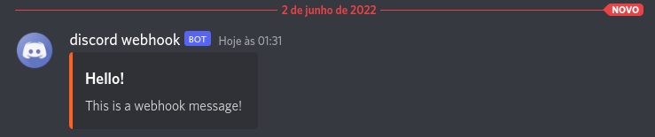

# Discord Webhook PHP

<div align='center'>
    
</div>


## Constructor parameter options
Pass an array of options to the constructor, note that the webhook url is required.


| param | type | description | Required |
|-------|------|-------------|----------|
| webhook_url | string | The webhook url (see how to create the webhook [here](https://support.discord.com/hc/en-us/articles/228383668-Intro-to-Webhooks)) | Yes
| tts | boolean | If true read message to channel members | No |
| thread_url | string | Name of thread to create (requires the webhook channel to be a forum channel) | No |


## Sending simple message 

```php

use Marcio1002\DiscordWebhook\DiscordWebhook;

$webhook = new DiscordWebhook([
    'webhook_url' => $webhook_url
]);


//Synchronous envio 
$webhook->sendMessageSync('This is a message');

//Asynchronous envio
$webhook->sendMessage('This is a message');

```